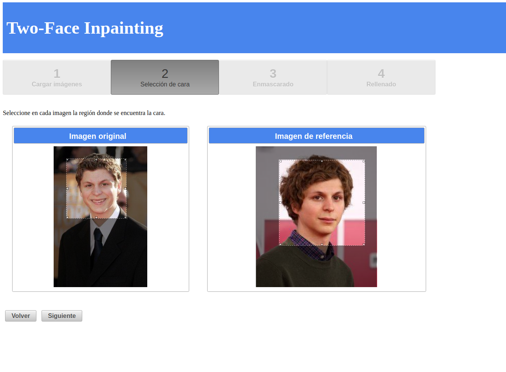
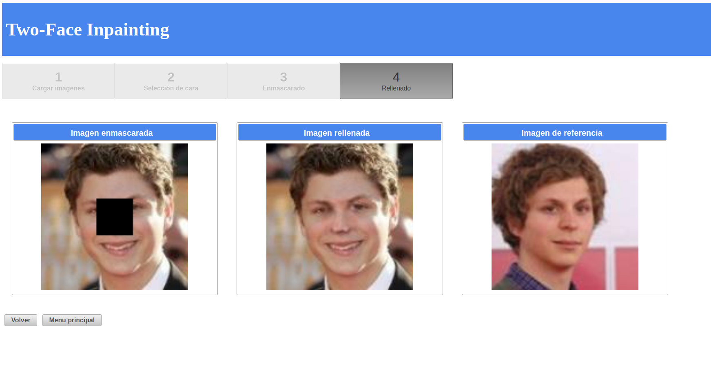

# Two-Face Web Client
Two-Face Web Client is a Web Application for testing the [Two-Face Inpainting](https://github.com/gsnaider/two-face-inpainting) model.<br/>
Two-Face Inpainting consists of a Machine Learning model that uses Generative Adversarial Networks for reconstructing missing regions of facial images. The model takes as input the masked image and a reference image from the same person (thus the name Two-Face Inpainting), and generates the missing region on the masked image.<br/>
This application allows the user to upload pictures of any person, crop the faces in each picture, and use them as input to the inpainting model in order to regenerate a region in one of those pictures. <br/>
Two-Face Inpainting was implemented as the final project for my Software Engineering degree at the University of Buenos Aires.


<br/>



## Index  
- [Documentation](#documentation)
- [Deployment](#deployment)
    * [Pre-requisites](#deploy-pre-requisites)
        + [Java 8](#java-8)
        + [Apache Tomcat](#apache-tomcat)
        + [Maven (for deploy from sources)](#maven)
    * [Deploy from binaries](#deploy-from-bin)
    * [Deploy from sources](#deploy-from-src)


<a name="documentation"/>

## Documentation
The full documentation of the project can be found [here](https://github.com/gsnaider/two-face-inpainting/blob/master/doc/Two-Face%20Inpainting.pdf) (in spanish).

<a name="deployment"/>

## Deployment
This section describes how to deploy the web application both from binaries and from sources, as well as the requirements to do so. Note that these instructions where only tested on Ubuntu 16.04.<br/>
If you want to run the whole application locally (the Web Application and [TensorFlow Serving](https://github.com/gsnaider/two-face-inpainting#deployment)), you can use the provided `two-face-inpainting.war` file from the Release 1.0. If you want to specify a different path for the TensorFlow Serving, you will have to edit the `backend` parameter in the `web.xml` file, and recompile from source.

<a name="deploy-pre-requisites"/>

### Pre-requisites

<a name="java-8"/>

#### Java 8

Java 8 is required for running the application. Java 8 can be installed via OpenJDK:

```sh
sudo apt-get install openjdk-8-jdk
```

For verifying the Java installation, execute the following:

```sh
java -version
```

and you should see a result similar to this one:

```sh
openjdk version "1.8.0_171"
OpenJDK Runtime Environment (build 1.8.0_171-8u171-b11-0ubuntu0.16.04.1-b11)
OpenJDK 64-Bit Server VM (build 25.171-b11, mixed mode)
```

Lastly, the `JAVA_HOME` environment variable needs to be configured. In order to do that, you can add the line `JAVA_HOME="/usr/lib/jvm/java-8-openjdk-amd64"` to the `/etc/environment` file, and refresh the environment variables by executing:

```sh
source /etc/environment
```

<a name="apache-tomcat"/>

#### Apache Tomcat

The Web Application runs on an Apache Tomcat server. The Tomcat version used for these instructions is 9.0, which can be downloaded from https://tomcat.apache.org/download-90.cgi. Once the download is finished, extract the content, create a directory `/opt/tomcat`, and move the `apache-tomcat-9.0.10` directory there:

```sh
tar -xvzf apache-tomcat-9.0.10.tar.gz
sudo mkdir /opt/tomcat
sudo mv apache-tomcat-9.0.10 /opt/tomcat/
```

<a name="maven"/>

#### Maven (for deploy from sources)
Maven is only required if you want to compile the application from the source code. It can be downloaded from https://maven.apache.org/download.cgi. Once downloaded, extract the content and move it to `/opt/maven`:

```sh
tar zxvf apache-maven-3.x.y.tar.gz
sudo mkdir /opt/maven
sudo mv apache-maven-3.x.y /opt/maven
```

You will also have to add `/opt/maven/apache-maven-3.x.y/bin` to the system `PATH`. To do this, open the `/etc/environment` file, and append `:/opt/maven/apache-maven-3.x.y/bin` to the end of the `PATH`. Finally, update the environment variables by running:

```sh
source /etc/environment
```

For verifying the instalation, execute:

```sh
mvn --version
```

<a name="deploy-from-bin"/>

### Deploy from binaries

Download the `two-face-inpainting.war` file from the Release 1.0, and move it to Tomcat's `webapps` directory:

```sh
sudo mv two-face-inpainting.war /opt/tomcat/apache-tomcat-9.0.10/webapps/
```

To start the server, from `/opt/tomcat/apache-tomcat-9.0.10` execute:
```sh
bin/startup.sh
```

To stop the server, execute:

```sh
bin/shutdown.sh
```

For monitoring the application logs, execute:

```sh
tail -f logs/catalina.out
```

Once the server starts, you can open the link http://localhost:8080/two-face-inpainting in a browser to use the application.

<a name="deploy-from-src"/>

### Deploy from sources

In order to generate the `.war` file from the source code, clone this repository and run:

```sh
mvn package
```

Then copy the generated `target/two-face-inpainting.war` file to `/opt/tomcat/apache-tomcat-9.0.10/webapps/`.
Afterwards, proceed as in [Deploy from binaries](#deploy-from-bin).


[//]: # (//TODO add license.)
[//]: # (//TODO add user manual.)